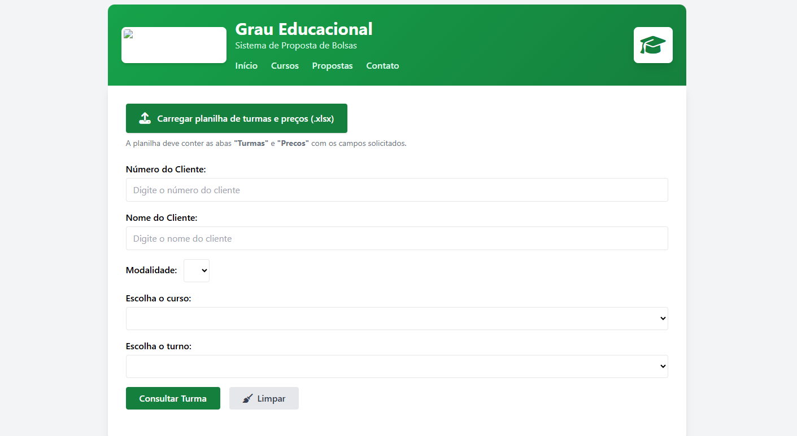
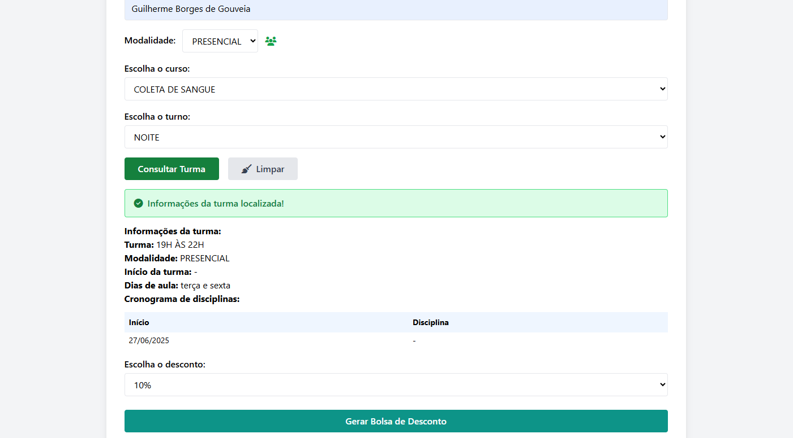
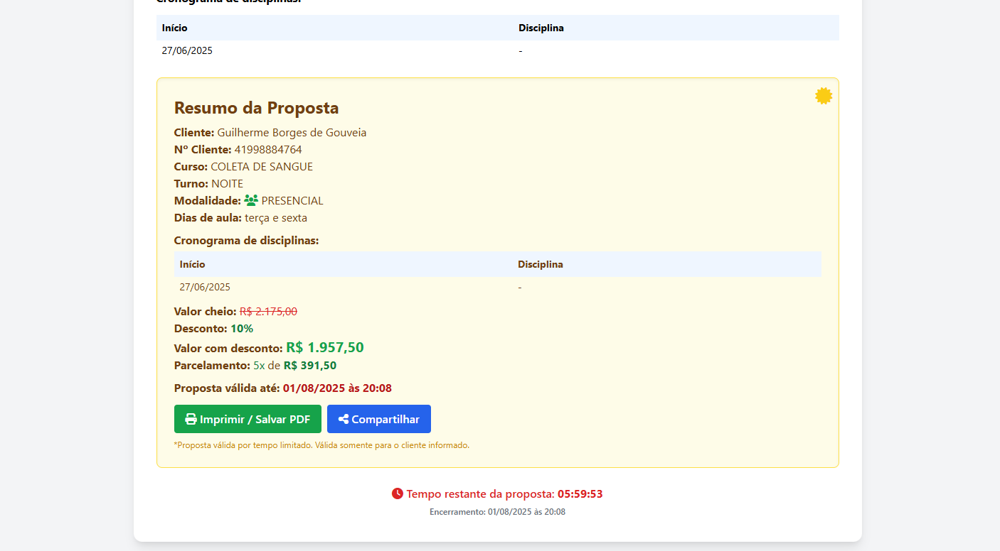

# Sistema de Bolsa de Desconto Dinâmica

## Visão Geral do Projeto

Este projeto consiste no desenvolvimento de um sistema web interno, criado para aprimorar a estratégia comercial de uma instituição educacional. O objetivo principal foi transformar a comunicação de "escassez" e "urgência" nas ofertas de bolsas de desconto, de um "papo de vendedor" em uma ferramenta visual e tangível, gerando maior credibilidade e engajamento com futuros alunos.

Como profissional da área de tecnologia com experiência em entender e resolver desafios de negócio, liderei o desenvolvimento desta solução.

## Desafio e Solução

**O Desafio:** A informação sobre "últimas vagas" ou "descontos por tempo limitado" era frequentemente percebida como um mero discurso de vendas, diminuindo a credibilidade da oferta.

**A Solução:** Desenvolvemos um site no servidor interno da empresa, onde o futuro aluno pode gerar sua própria **"Bolsa de Desconto Dinâmica"**. Este sistema apresenta as seguintes funcionalidades-chave:

* **Prazo de Validade Explícito:** Cada bolsa gerada possui um contador regressivo claro, reforçando a urgência da oferta.
* **Indicação de "Últimas Bolsas":** Visibilidade clara da disponibilidade limitada das oportunidades.
* **Geração de PDF Personalizada:** Formaliza a oferta, contendo todos os detalhes e o desconto aplicado, aumentando a transparência e a credibilidade.

## Demonstração do Fluxo

A seguir, apresentamos algumas telas do sistema para ilustrar seu funcionamento:

### 1. Tela Inicial e Entrada de Dados

Nesta tela, o sistema está pronto para receber as informações do cliente e iniciar o processo de busca pela bolsa de desconto ideal. O foco na interface intuitiva permite uma interação fluida para o usuário.



### 2. Consulta de Turmas e Aplicação de Desconto

Após a seleção do curso e turno, o sistema processa as informações para consultar a disponibilidade da turma e aplicar as regras de negócio para encontrar a melhor oferta de desconto, exibindo-a de forma clara.



### 3. Resumo da Proposta com Escassez e Urgência

A tela final consolida todas as informações da proposta. O desconto, o prazo de validade (com o cronômetro em tempo real!) e a opção de gerar o PDF são apresentados, validando a escassez de forma visual e inegável.



## Habilidades e Tecnologias Aplicadas

Este projeto me permitiu aplicar e aprofundar conhecimentos em diversas áreas da tecnologia:

* **Desenvolvimento Web (Frontend):** Construção da interface de usuário intuitiva e responsiva (HTML, CSS, JavaScript).
* **Desenvolvimento Web (Backend):** Implementação da lógica de processamento de dados localmente no navegador, sem necessidade de servidor backend tradicional, demonstrando soluções eficazes para ambientes offline/internos (usando JavaScript e a biblioteca `xlsx.full.min.js` para manipulação de planilhas Excel).
* **Integração de Dados via Excel:** Desenvolvimento de funcionalidade para que os dados de turmas, horários, valores e outras configurações sejam facilmente atualizados através de um arquivo Excel. Isso proporciona agilidade e autonomia na gestão do conteúdo do sistema, sem a necessidade de intervenções no código.
* **Análise e Resolução de Problemas:** Transformação de uma necessidade comercial em uma solução tecnológica funcional e eficaz.
* **UX/UI Design:** Foco na experiência do usuário para tornar o processo de geração da bolsa simples e transparente.

## Como Executar

### Dados de Configuração
Este sistema utiliza um arquivo Excel para carregar dinamicamente os dados de turmas, horários, valores e outras configurações. Para fins de demonstração e teste, incluí um arquivo de exemplo (`assets/turmas_evalores_exemplo.xlsx`) que contém dados fictícios. **Os dados reais da instituição não estão incluídos neste repositório por questões de segurança e confidencialidade.**

1.  **Pré-requisitos:** Apenas um navegador web moderno (ex: Chrome, Firefox, Edge).
2.  **Clonar o Repositório:**
    ```bash
    git clone [https://github.com/guiborgex/sistema-bolsa-desconto.git](https://github.com/SEU_USUARIO/sistema-bolsa-desconto.git)
    ```
3.  **Abrir no Navegador:** Navegue até a pasta clonada do projeto e abra o arquivo `central.html` diretamente no seu navegador de preferência. Por exemplo, você pode arrastá-lo e soltá-lo na janela do navegador, ou clicar duas vezes nele.
4.  **Anexar o Arquivo Excel:** No próprio sistema, haverá uma opção para "Carregar planilha de turmas e preços (.xlsx)". Selecione o arquivo `turmas_evalores_exemplo.xlsx` (disponível na pasta `assets/turmas_evalores_exemplo.xlsx` deste repositório) para carregar os dados de exemplo.


## Contato

Conecte-se comigo no LinkedIn para mais discussões sobre tecnologia e negócios:
[Guilherme Borges de Gouveia no LinkedIn]([https://www.linkedin.com/in/SEU_PERFIL_LINKEDIN/](https://www.linkedin.com/in/guilherme-borges-de-gouveia-567966359/))
